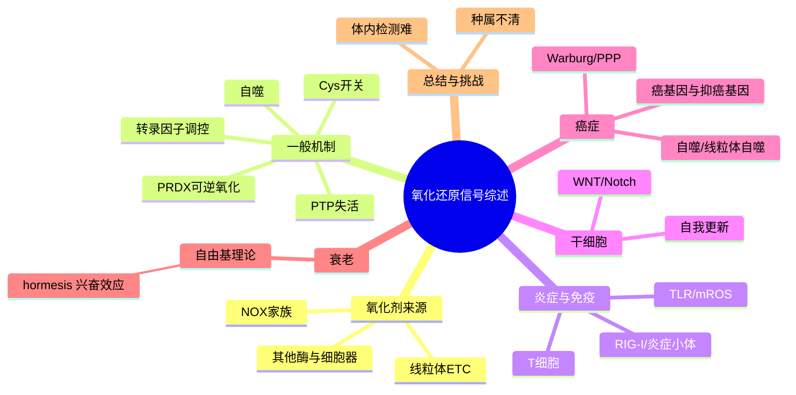
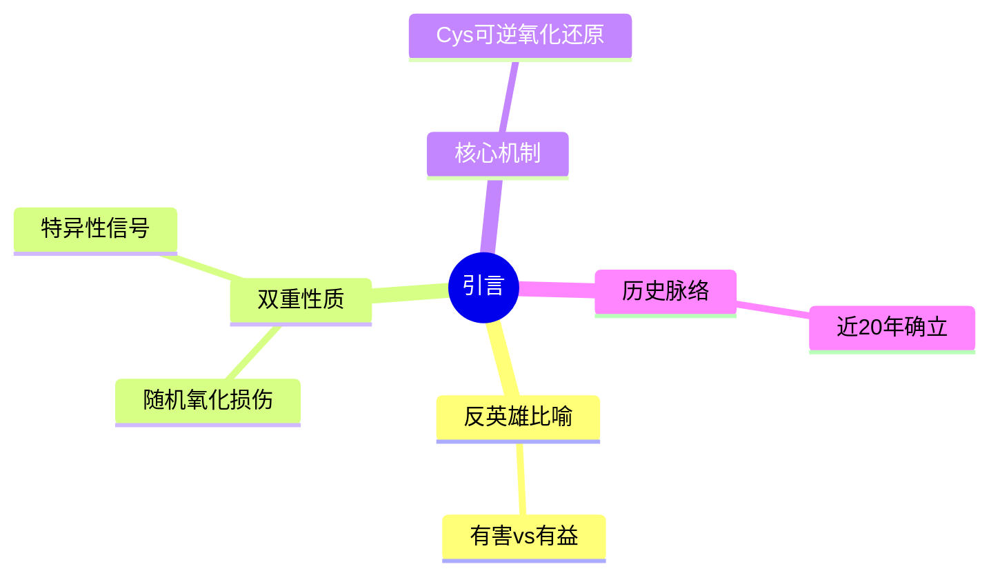
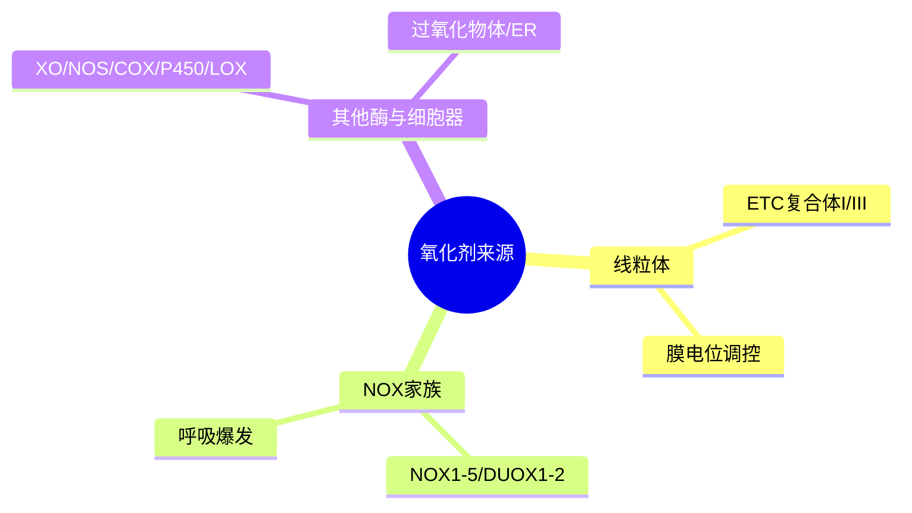
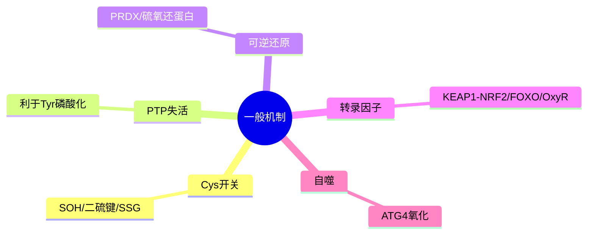
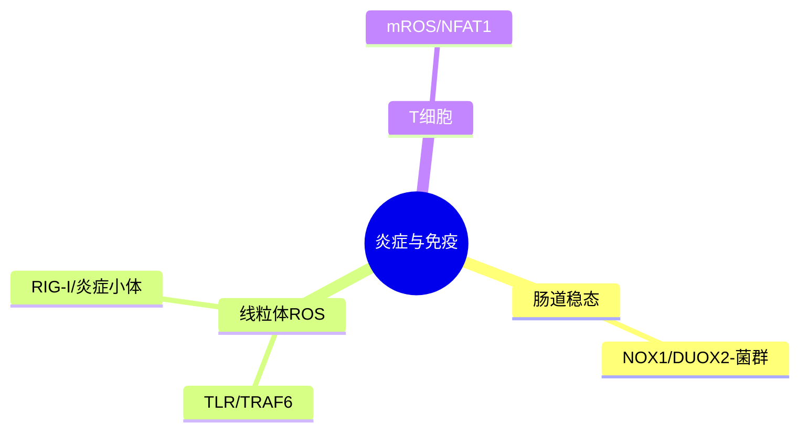
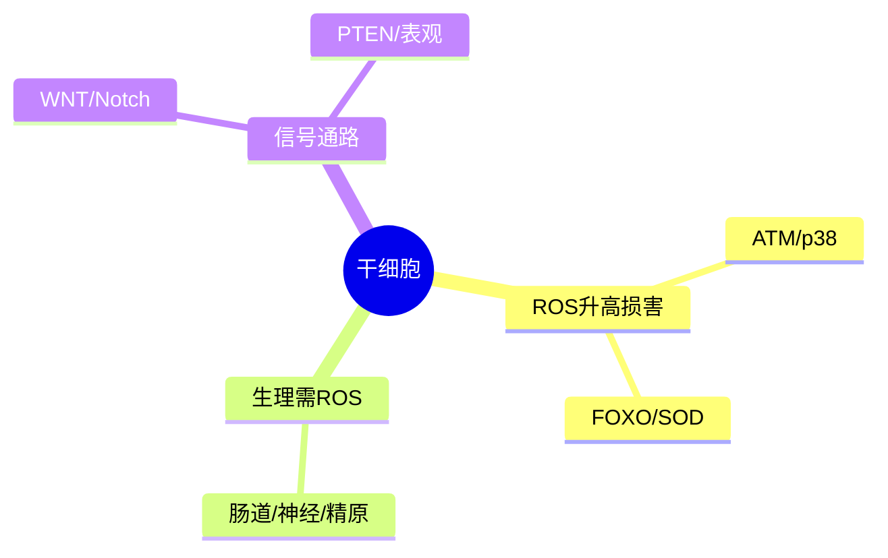
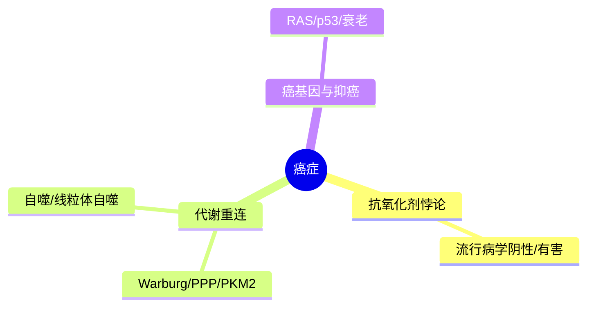
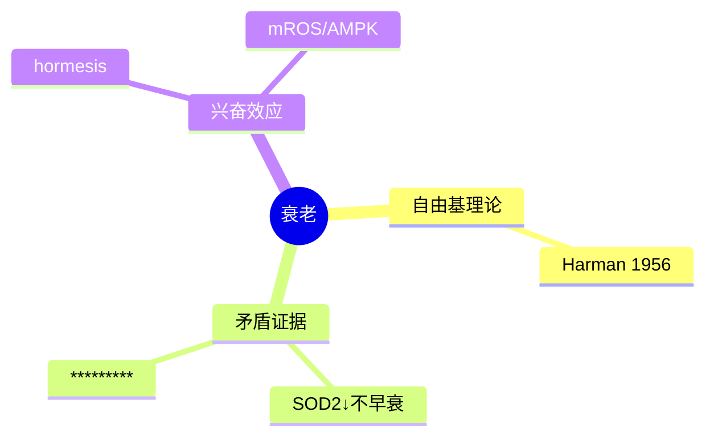
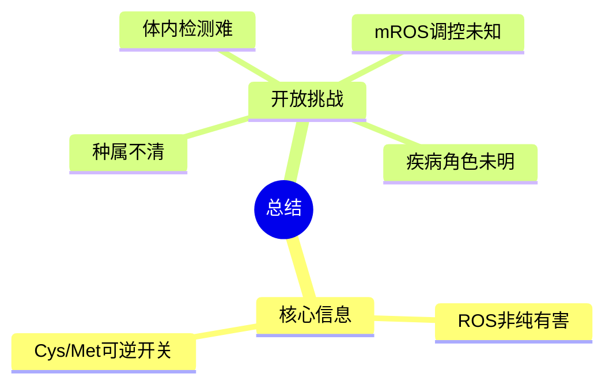

# 《Cellular mechanisms and physiological consequences of redox-dependent signalling》章节关键总结

> 来源：`nrm3801.pdf`（Nature Reviews Molecular Cell Biology, Vol. 15, June 2014, pp. 411–419）
> 作者：Kira M. Holmström & Toren Finkel · doi:10.1038/nrm3801
> 共 11 页（正文 PDF p.1–9，参考文献 p.10–11） · 说明：PDF 内嵌书签切分失效，以下章节依据正文小标题与内容重建 · 生成日期 2026-08-09

## 缩写词表（Abbreviations）
> 全称以书中原文为准；原文未展开者标注"原文未给出全称"。

| 缩写 | 全称（原文） | 出处 |
|------|--------------|------|
| ROS | reactive oxygen species（活性氧） | 摘要，PDF p.1 |
| mROS | mitochondrial reactive oxygen species（线粒体活性氧） | PDF p.4 |
| NOX | NADPH oxidase（NADPH 氧化酶家族） | PDF p.2 |
| DUOX | dual oxidase（双氧化酶，DUOX1/2） | PDF p.2 |
| SOD | superoxide dismutase（超氧化物歧化酶） | Box 2，PDF p.4 |
| GSH | glutathione（谷胱甘肽） | Box 2，PDF p.4 |
| PRDX | peroxiredoxin（过氧化物还原酶） | Box 2 / PDF p.3 |
| PTP | protein Tyr phosphatase（蛋白酪氨酸磷酸酶） | PDF p.3 |
| PTEN | （原文未给出全称，磷酸酶，调控 PI3K–AKT–GSK3β） | PDF p.6 |
| NRF2 | nuclear factor erythroid 2-related factor 2 | PDF p.4 |
| KEAP1 | Kelch-like ECH-associated protein 1 | PDF p.4 |
| CUL3 | cullin 3（E3 泛素连接酶） | PDF p.4 |
| FOXO | forkhead box protein O（forkhead 转录因子家族） | PDF p.4 |
| GST | GSH S-transferase（谷胱甘肽 S-转移酶） | PDF p.4 |
| ATM | ataxia telangiectasia mutated（共济失调毛细血管扩张突变激酶） | PDF p.6 |
| HSC | haematopoietic stem cell（造血干细胞） | PDF p.6 |
| HGF | hepatocyte growth factor（肝细胞生长因子） | PDF p.6 |
| PRDM16 | PR domain-containing protein 16 | PDF p.6 |
| MDM2 | E3 ubiquitin ligase that regulates p53 levels | PDF p.6 |
| TLR | Toll-like receptor（ Toll 样受体） | PDF p.5 |
| TRAF6 | TNF receptor-associated factor 6 | PDF p.5 |
| RIG-I | retinoic acid-inducible gene I | PDF p.5 |
| NF-κB | nuclear factor-κB | PDF p.5 |
| NFAT1 | nuclear factor of activated T cells 1 | PDF p.5 |
| WNT | （原文未给出全称，WNT 信号通路） | PDF p.6 |
| DVL | Dishevelled | PDF p.6 |
| NRX | nucleoredoxin（核氧化还原蛋白） | PDF p.6 |
| TCF | T cell factor（T 细胞因子家族） | PDF p.6 |
| GSK3β | glycogen synthase kinase 3β | PDF p.6 |
| PI3K | phosphatidylinositol 3-kinase | PDF p.3 |
| PDGF | platelet-derived growth factor（血小板衍生生长因子） | PDF p.2 |
| EGF | epidermal growth factor（表皮生长因子） | PDF p.2 |
| TNF | tumour necrosis factor（肿瘤坏死因子） | PDF p.2 |
| PPP | pentose phosphate pathway（磷酸戊糖途径） | PDF p.7 |
| PKM2 / PKM | pyruvate kinase M2（丙酮酸激酶 M2 亚型） | PDF p.7 |
| TIGAR | TP53-induced glycolysis and apoptosis regulator | PDF p.7 |
| AMPK | AMP-activated protein kinase（AMP 活化蛋白激酶） | PDF p.8 |
| eIF2α | eukaryotic translation initiation factor 2α | PDF p.8 |
| CHK2 | checkpoint kinase 2 | PDF p.8 |
| BMI1 | Polycomb protein（多梳蛋白，维持干细胞自我更新） | PDF p.6 |
| NEDD8 | ubiquitin-like protein（类泛素蛋白） | PDF p.5 |
| UBC12 | NEDD8-conjugating enzyme | PDF p.5 |
| SIRT | sirtuin（NAD 依赖去乙酰酶家族，含 SIRT3） | Box 2，PDF p.4 |
| CaMKII | calcium/calmodulin-dependent kinase（由 CAMK2G 编码） | PDF p.3 |
| AP1 | activator protein 1（转录因子） | PDF p.3 |
| OxyR | bacterial redox-sensitive transcription factor（细菌抗氧化应激转录因子） | PDF p.3 |
| ER | endoplasmic reticulum（内质网） | FIG 2，PDF p.3 |
| LCFA | long-chain fatty acid（长链脂肪酸） | FIG 2，PDF p.3 |
| ETC | electron transport chain（电子传递链） | PDF p.2 |
| LPS | lipopolysaccharide（脂多糖） | PDF p.5 |
| SOH | sulphenic acid（次磺酸） | FIG 4，PDF p.5 |
| SSG | S-glutathionylated（谷胱甘肽化） | FIG 4，PDF p.5 |

## 全书概览
本文是一篇关于**氧化还原（redox）依赖型信号转导**的权威综述。作者开宗明义地用"反英雄（antihero）"比喻 ROS：过去认为 ROS 是无差别、随机、有害的"副作用"，如今越来越多的证据表明低水平 ROS 可作为**特异性信号分子**，其核心机制是可逆地氧化/还原关键的**半胱氨酸（Cys）残基**（以及甲硫氨酸 Met）。文章系统梳理了（1）细胞内 ROS 的来源（线粒体、NOX 家族、其他酶与细胞器）；（2）氧化信号的一般机制（Cys 开关、PTP 失活、PRDX 可逆氧化、转录因子调控、自噬）；（3）ROS 在**先天免疫/炎症、干细胞生物学、癌症、衰老**四大生理与病理场景中的双重角色；（4）尚存的核心挑战。贯穿全书的主线是：ROS 既不是单纯的"英雄"也不是"恶棍"，而是占据两者之间的、受时空限定的可逆信号中介。

## 全书思维导图

## 目录
1. [引言：ROS 的"反英雄"双重属性](#1-引言ros-的反英雄双重属性) — PDF p.1
2. [氧化剂来源（Oxidant sources）](#2-氧化剂来源oxidant-sources) — PDF p.1–3
3. [氧还信号的一般机制（General mechanisms）](#3-氧还信号的一般机制general-mechanisms) — PDF p.3–5
4. [ROS 与炎症反应（ROS signalling in the inflammatory response）](#4-ros-与炎症反应ros-signalling-in-the-inflammatory-response) — PDF p.5–6
5. [ROS 与干细胞生物学（ROS and stem cell biology）](#5-ros-与干细胞生物学ros-and-stem-cell-biology) — PDF p.6–7
6. [ROS 与癌症（ROS and cancer）](#6-ros-与癌症ros-and-cancer) — PDF p.7–8
7. [ROS 与衰老（ROS and ageing）](#7-ros-与衰老ros-and-ageing) — PDF p.8–9
8. [总结（Summary）](#8-总结summary) — PDF p.9

---

## 1. 引言：ROS 的"反英雄"双重属性

**核心立意：** 提出全书论点——ROS 兼具"有害副产物"与"有益信号"两面，是生物学意义上的"反英雄"。

**关键要点：**
- 传统观点：ROS 产生不受调控、靶标随机，其氧化脂质/蛋白/DNA 造成积累性损伤，与神经退行性疾病、动脉粥样硬化、衰老相关。
- 新观点：超氧阴离子（O₂•⁻）和过氧化氢（H₂O₂）等可作为信号信使；因 H₂O₂ 更稳定，更适合作为信号中间体。
- 核心机制：redox 依赖信号主要基于**关键 Cys 残基的氧化与还原**，是高度保守、可能很古老的机制。
- 特异性来源：氧还信号如何取得特异性长期存疑；近期证据提示**氧化剂与其靶标在细胞内空间上被局限**（spatial confinement）至少部分解释了特异性。
- 该综述将讨论 ROS 在代谢调控、先天免疫、干细胞、癌症发生、衰老中的作用。
- 文末点题：ROS 研究正从"纯有害"转向"可逆、受控、具生物学意义"的 nuanced 视角。

---

## 2. 氧化剂来源（Oxidant sources）

**核心立意：** 概述细胞内 ROS 的主要来源，重点是比较定量的线粒体与 NOX 家族，并指出其他酶/细胞器贡献的细胞类型依赖性。

**关键要点：**
- **线粒体（Mitochondria）**：多数细胞类型中最大的胞内氧化剂来源。电子传递链（ETC）复合体 I–III 是超氧产生主要位点，既可在基质侧也可在线粒体内膜间隙产生（FIG. 1）；基质酶 OGDH、PDH 及膜结合型 GPDH、FQR 也有贡献。
  - 调控：质子驱动力（proton-motive force）↑ → ROS ↑；膜电位极端值关联明确，但具体关系仍不清楚。氧气可得性也存矛盾证据（高氧与低氧下 ROS 均可升高）。
  - 历史视角：线粒体氧化剂长期被视为纯毒性，现已知其可调控重要信号通路。
- **NADPH 氧化酶（NOX）**：最早在中性粒细胞中发现，用于宿主防御（吞噬体 ROS 杀伤微生物），即"呼吸爆发（respiratory burst）"。催化亚基原称 gp91phox，现称 NOX2；患者 NOX2 突变致慢性肉芽肿病（chronic granulomatous disease）。
  - 非吞噬细胞：TNF、血管紧张素 II、PDGF、EGF 等配体可快速升高 ROS；克隆鉴定出 NOX1（RAC1 调控的 NOX2 同源物）及 p22phox。
  - 人类共 7 个同源物（NOX1–5、DUOX1、DUOX2），用于宿主防御与信号；单个 NOX 或 p22phox 缺失小鼠表型相对缺失，提示 ROS "调节而非绝对必需"，或存在冗余。
- **其他酶**：黄嘌呤氧化酶、一氧化氮合酶（NOS）、环氧合酶（COX）、细胞色素 P450（Cytochrome P450）、脂氧合酶（lipoxygenase）均可产 ROS（FIG. 2）；过氧化物酶体（β-氧化 LCFA）、内质网（ER 应激）也产生氧化剂。
  - 经典看法视其为副产物或经 Fenton 化学与细胞内不稳定铁池（<20 μM Fe²⁺）反应；但最近细胞色素 P450 研究显示其产生的 H₂O₂ 可调控肾上腺皮质激素生成的昼夜节律，提示其具信号功能。

---

## 3. 氧还信号的一般机制（General mechanisms）

**核心立意：** 阐明 ROS 通过可逆修饰 Cys（及 Met）残基调控蛋白功能的一般原理，并介绍关键的下游靶标与还原回路。

**关键要点：**
- **Cys 作为 redox 开关（FIG. 4）**：生理 pH 下活性 Cys 形成硫醇阴离子（S⁻），氧化成次磺酸（SOH）常导致功能改变；SOH 可进一步氧化，或经直接还原、形成分子内二硫键、与 GSH 结合形成 S-谷胱甘肽化（SSG）中间体而逆转。
- **经典范例——生长因子信号（FIG. 3）**：PDGF/EGF 刺激后 Tyr 磷酸化升高之前先有 ROS 爆发，且 ROS 为该下游信号所必需。机制：①配体刺激经 NOX 家族产 ROS；②ROS 氧化 PTP 活性中心保守 Cys 使其失活，使 Tyr 激酶活性占优。除 PTP 外，ROS 还可直接修饰 EGF 受体胞内域 Cys 激活受体；GSH、H₂S、脂质过氧化物亦可瞬时失活 PTP。
- **可逆性**：PRDX 家族将 SOH 经硫氧还蛋白或 GSH 途径还原；更高氧化态（亚磺酸 SOH'）→需硫氧还蛋白还原酶（sulphiredoxin）。PRDX 的"higher-order"可逆氧化支撑"floodgate model"（ FIGS 提及）；PRDX 可逆氧化还与昼夜节律相关。特异性还来自 ROS 产生/扩散被局限在富含 redox 靶标的亚细胞区域。
- **其他可氧化氨基酸**：Met 残基也可作类似 redox 系统（被 H₂O₂ 氧化速率约为 Cys 的 1/4，但在强氧化剂如 HOCl 下相近）；actin 聚合与 CaMKII 活性可由特定 Met 氧化可逆调控。转录因子亦 redox 敏感（AP1、细菌 OxyR 经 Cys 氧化成 SOH 再形成分子内二硫键锁活）。
- **转录因子调控**：FOXO 家族 Cys 氧化促二硫键介导的新蛋白互作（如 FOXO4–transportin 1 核转位）；KEAP1–NRF2 通路中，ROS 氧化 KEAP1 的 Cys → 释放 NRF2 → 核积累 → 结合抗氧化响应元件（ARE）上调 GST、血红素氧合酶 1 等。Cys 蛋白酶 ATG4 也是线粒体氧化剂的靶标（饥饿下 mROS↑ → ATG4 失活 → 自噬体形成↑）。
- **抗氧化防御（Box 2）**：SOD 只作用于超氧，过氧化氢酶与 PRDX 只作用于 H₂O₂；越来越多证据显示它们也可是"感受器/转导器"（如 SOD1 代谢超氧产生 H₂O₂ 信号调控代谢）。非酶系统以 GSH 最重要（毫摩尔级），经 PPP 提供 NADPH 维持还原态；SIRT 家族（尤其线粒体 SIRT3）亦参与 redox 稳态。
- **检测策略（Box 1）**：稳态 ROS 为纳摩尔级；常用荧光探针 DCF-DA（对 H₂O₂ 准确性存疑），较新硼酸盐探针特异性更高；可加 TPP 基团靶向线粒体。遗传传感器如 HyPer（含 OxyR 感 H₂O₂ 结构域）、roGFP2 具可逆荧光、可亚细胞定位等优势。

---

## 4. ROS 与炎症反应（ROS signalling in the inflammatory response）

**核心立意：** 展示 ROS 在先天免疫中兼具"宿主防御"与"信号转导"的双重角色，并强调线粒体 ROS（mROS）在免疫中的主动调控作用。

**关键要点：**
- NOX 依赖的氧化剂产生可能很古老（模式生物免疫中存在类似系统）。信号与防御的汇合在肠道最明显：NOX1、DUOX2 在肠上皮高表达，共生菌可刺激上皮 ROS 产生；有益菌尤能促 NOX1 依赖的 ROS↑，进而促进肠道干细胞增殖维持稳态。菌群经 redox 通路调控 NF-κB 与 β-catenin（通过细菌刺激 ROS 氧化 NEDD8 连接酶 UBC12 的 Cys，影响蛋白稳定性，调控 NF-κB 与 WNT）。
- **mROS 的主动调控**：传统认为 mROS 缺乏动态调控，但近期研究显示 mROS↑ 对巨噬细胞清除细菌必需——由 TLR 激活、TRAF6 转位至线粒体触发；LPS 诱导细胞因子产生也依赖 mROS。
- mROS 信号扩展至 **RIG-I 病毒识别信号**与**炎症小体（inflammasome）**激活：功能异常的线粒体所"发出"的危险信号即是 ROS；接收该信号的胞质效应器尚不清楚。
- **T 细胞**：条件性失活 ETC 复合体 III → mROS↓ → T 细胞激活与克隆扩增缺陷（部分经 NFAT1 的 redox 调控）；巨噬细胞向效应亚型分化也需 mROS。

---

## 5. ROS 与干细胞生物学（ROS and stem cell biology）

**核心立意：** 综述 ROS 水平需"窄窗口"调控以维持干细胞功能——过高损害自我更新，但生理水平 ROS 对某些干细胞的稳态不可或缺。

**关键要点：**
- 多数数据（主要来自 HSC）表明 ROS 升高损害干细胞功能（尤其自我更新）。ATM 缺失 → 多种细胞 ROS↑ → Atm⁻/⁻ HSC 自我更新缺陷，可被抗氧化剂 NAC 挽救（经 p38 MAPK 的 redox 激活限制自我更新）。FOXO 家族缺失小鼠干细胞抗氧化防御蛋白（SOD、过氧化氢酶）↓ → ROS↑ → 自我更新缺陷（部分被 NAC 挽救）。BMI1、PRDM16、MDM2 缺失模型亦将 ROS 代谢异常与干细胞缺陷相连。
- 但"降低 ROS 改善干细胞"仅在 ROS 人为偏高时成立；生理水平 ROS 对正常干细胞功能必需。NOX 家族产生的 ROS 促进神经干细胞自我更新与成体神经元稳态、精原干细胞； Drosophila 中 ROS 对某些造血祖细胞成熟至关重要。胚胎干细胞中无论升/降 ROS 均可致基因组不稳定，支持"窄窗口"假说。
- **靶标与通路**：NOX1/NOX2 与线粒体 ROS 调控 WNT 与 Notch 信号。WNT 配体刺激 NOX1 产 ROS → 氧化核氧化还原蛋白 NRX（其两个 Cys 205/208 关键）→ 解除 NRX–DVL 互作 → β-catenin 稳定 → 与 TCF/FOXO 互作调控靶基因。NOX1-ROS 还可经 redox 修饰 PTEN 改变 PI3K–AKT–GSK3β 信号调控 β-catenin 稳定性。
- **表观遗传**：氧化与染色质修饰的联系最初在酵母中确立，组蛋白去泛素化酶等去泛素化酶可受 ROS 水平调控，该方向预期扩大。

---

## 6. ROS 与癌症（ROS and cancer）

**核心立意：** 解析 ROS 在癌症中的矛盾角色——既可经 DNA 损伤促基因组不稳定、又可在某些情境下被癌细胞利用；并解释抗氧化剂干预的潜在风险。

**关键要点：**
- **抗氧化剂悖论（FIG. 5）**：直觉上抗氧化剂降 ROS→减 DNA 损伤→防癌；但大型流行病学试验多显示无效，部分甚至增加癌症风险。可能因癌细胞处于" permanent oxidative stress"状态；且 ROS 在"癌启动"与"已建肿瘤生长"中角色不同。
- **代谢联系（Warburg 效应）**：癌细胞高有氧糖酵解；葡萄糖亦可转向 PPP 产 NADPH 维持 GSH 还原态（GSH 是最重要胞内抗氧化剂）。糖走向由丙酮酸激酶决定；肿瘤表达 PKM2，ROS 氧化 PKM2 特定 Cys → 葡萄糖从乳酸生成转向 PPP → NADPH↑ → GSH redox 缓冲。此即 ROS 依赖的 Cys 信号的又一例。
- **自噬联系**：肿瘤代谢重连更依赖自噬；饥饿↑ROS→（Cys 氧化）失活 ATG4（自噬体形成负调控因子）；TIGAR 将代谢转向 PPP 降 ROS 与自噬流；自噬流缺失→ROS↑→DNA 损伤↑（可能与线粒体自噬 mitophagy 缺失致缺陷线粒体累积有关）。mROS 与肿瘤细胞转移潜能相关。
- **癌基因/抑癌基因**：RAS 等癌基因、p53 等抑癌蛋白可直接/间接改变细胞 redox 状态；癌基因诱导的衰老（OIS）伴随 ROS 改变。抗氧化剂在某些情况下增癌风险，可能因助携带突变的细胞绕过 ROS 依赖的衰老生长阻滞。部分癌突变可特异增强抗氧化防御促肿瘤生长；靶向癌细胞独特 redox 状态是重要治疗方向。

---

## 7. ROS 与衰老（ROS and ageing）

**核心立意：** 回顾 ROS 与衰老半个多世纪的争论，呈现"有害"与"有益（hormesis）"两类相反证据，强调 mROS 在一定条件下可诱导延长寿命的保护性程序。

**关键要点：**
- 历史：Harman 1956 年提出自由基衰老理论。支持与反对证据参半：SOD2 表达遗传性降低的小鼠 ROS↑ 但未加速衰老；蠕虫中某些 SOD  isoform 降低反而延寿；而线粒体过表达过氧化氢酶（catalase）的小鼠寿命延长。
- ** hormesis（兴奋效应）新转折**：低水平应激保护机体抵御后续更大应激。限糖蠕虫寿命延长与线粒体代谢代偿性增强、低水平 ROS 生成相关，需能量感受激酶 AAK-2（哺乳类 AMPK 同源物）激活；类似 mROS 中心模型可解释 daf-2 突变等长寿模型。其他组成型 ROS↑ 的遗传模型则加速衰老。
- mROS 通过多条通路介导 hormetic 反应：蠕虫 eIF2α 激酶 GCN-2、酵母 Tel1p（ATM 同源）/Rad53p（CHK2 同源）等。临床小研究：运动有益效应在服用抗氧化补充剂者中被消除，可能因抑制了 ROS 依赖的 hormetic 反应。

---

## 8. 总结（Summary）

**核心立意：** 收束全书——ROS 通过 Cys/Met 的可逆氧化还原快速调控蛋白功能，但诸多根本问题（化学种属、体内检测、mROS 调控、疾病角色）仍悬而未决。

**关键要点：**
- ROS 已非"纯有害"，而是可特异性调控生物学相关通路；如同 Ser/Thr 的磷酸化/去磷酸化，Cys/Met 的氧化/还原提供快速可逆改变蛋白功能的机制（FIG. 6 归纳：影响蛋白稳定性、活性、亚细胞定位、蛋白互作）。
- **开放问题**：①对任一 redox 通路，相关化学种属（超氧 vs H₂O₂ 化学迥异）常不清楚；②体内氧化剂检测仍困难；③控制 mROS 产生/释放的调控机制细节缺失；④未来需能特异性改变 mROS 而不改变生物能量状态的遗传工具；⑤ROS 在疾病中的确切角色（防癌还是促癌？致衰还是抗衰？）大多未知。
- 终句呼应开篇：ROS 既非细胞英雄也非恶棍，而是占据那"always entertaining, captivating and fertile middle ground（饶有趣味、引人入胜且充满可能的中间地带）"的分子。

**附：图表索引（原文 Figures / Boxes）**
- FIG 1：线粒体内 ROS 产生位点（复合体 I/III 为主；基质侧与膜间隙；OGDH/PDH/GPDH/FQR）
- FIG 2：胞内 ROS 来源（细胞器 + 酶系统）
- FIG 3：ROS 作为胞内信号介质（生长因子→NOX→H₂O₂→PTP 失活）
- FIG 4：活性 Cys 残基的可逆调控（硫醇阴离子→SOH→二硫键/SSG）
- FIG 5：抗氧化剂在肿瘤发生中的有益/有害双重角色
- FIG 6：氧化剂信号影响细胞功能的多种方式
- Box 1：ROS 检测策略（DCF-DA、硼酸盐探针、HyPer、roGFP2）
- Box 2：抗氧化防御（SOD、过氧化氢酶、PRDX、GSH、SIRT3）
