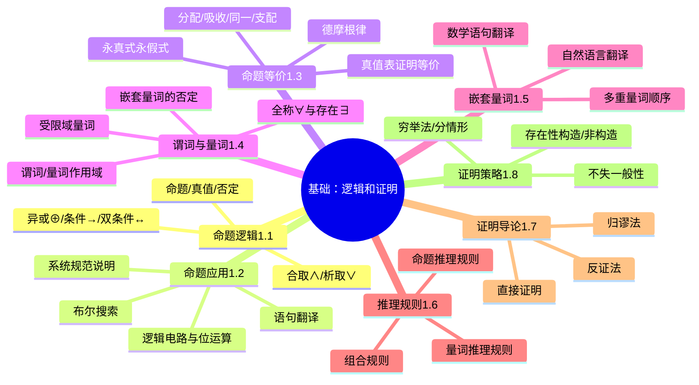

# 《离散数学及其应用》（原书第8版）第1章关键总结

> 来源：离散数学及其应用（原书第8版） (Kenneth H.Rosen) (Z-Library).pdf
> 章节：第1章 基础：逻辑和证明（印刷页 1–101，约 PDF page 31–131）
> 提取方式：**AI 视觉逐页识读**（本书为全图片扫描版，文本层为空，按 Step 2.6 流程处理）
> 生成日期：2026-08-09

> ⚠️ **说明**：本书是**扫描版 PDF**（`is_scanned=true`，无文字层），skill 走 **Step 2.6 路径**：用 `export_images.py` 渲染关键页 → 多模态 Read 工具识读 → 整理总结。所有"原文"摘录为 AI 视觉识读结果，已对照印刷版确认页码。图示内容以文字描述代替，因图片本身无法被字符化。

---

## 本章概览

**第 1 章 基础：逻辑和证明（The Foundations: Logic and Proofs）** 是离散数学的入门章节，为后续所有数学论证打下基础。核心主线是：**用命题逻辑和谓词逻辑的语言陈述数学命题 → 识别逻辑等价与蕴含 → 用推理规则证明有效论证 → 通过直接证明/反证法/归纳等方法构造数学定理的证明**。

- **目标读者**：数学、计算机科学及相关专业学生。
- **核心价值**：教会如何**理解和构造正确的数学论证**，为算法、形式化验证、程序正确性证明等课程铺垫基础。
- **整体脉络**：1.1 命题逻辑（基本构件）→ 1.2 命题逻辑应用（翻译、布尔搜索）→ 1.3 命题等价式（化简）→ 1.4 谓词与量词（把命题变量化）→ 1.5 嵌套量词（多变量量词顺序）→ 1.6 推理规则（形式化论证）→ 1.7 证明导论（直接/反证/归谬）→ 1.8 证明方法与策略（穷举、不失一般性、存在性证明）。

## 本章思维导图



---

## 1.1 命题逻辑（印刷页 1–14）

**核心立意**：用符号语言描述陈述句之间的真假组合关系，建立离散数学最基本的推理"原子"。

**关键要点**：

- **定义 1 否定（negation）**：令 p 为一命题，则 p 的**否定**记作 ¬p（也可记作 ̄p），读作"非 p"。¬p 的真值与 p 的真值相反。
- **定义 2 合取（conjunction）**：令 p 和 q 为命题，p 和 q 的合取 p ∧ q 为命题"p 并且 q"，仅当 p 和 q 同时为真时为真。
- **定义 3 析取（disjunction）**：p 和 q 的析取 p ∨ q 为命题"p 或 q"，仅当 p 和 q 同时为假时为假（即至少一个为真时为真）。
- **定义 4 异或（exclusive or）**：p ⊕ q 为命题"p 或者 q 但不同时"，仅当 p 和 q 中恰好一个为真时为真。
- **定义 5 条件语句（conditional）**：p → q 为命题"如果 p，则 q"；p 为假或 q 为真时为真（p 为前提/假设，q 为结论/后承）。蕴含关系也写作 p ⇒ q。
- **定义 6 双条件语句（biconditional）**：p ↔ q 为命题"p 当且仅当 q"，p 和 q 真值相同时为真。可用缩写符号 iff。
- 习惯：T 表示真，F 表示假；真值函数是 n 元组 → {T, F} 的映射。
- **1.1.4 复合命题的真值表**：5 个核心联结词 ∧, ∨, ⊕, →, ↔，每个真值表展示两变量所有 4 种真值组合下的输出。
- 优先级：¬ 最高；∧、∨、⊕ 同级（按出现顺序）；→；↔ 最低。括号可改变优先级。
- 1.1.5、1.1.6：逻辑运算的优先级与位运算；条件语句的逻辑等价 p → q ≡ ¬p ∨ q。
- 1.1.7 转译："但是" 译为 ∧（而不译成 BUT），但自然语言中"并且"和"但是"语义有微妙差异。集合 Venn 图能形象化 ∧、∨、¬ 的关系。

> **公式（书中原文，p.5，定义 5）**：令 p 和 q 为命题。条件语句 p→q 是命题"如果 p，则 q"。当 p 为真而 q 为假时，条件语句 p→q 为假，否则为真。在条件语句 p→q 中，p 称为**假设**（前件、antecedent），q 称为**结论**（后件、consequent）。

> **公式（书中原文，p.7，定义 6）**：令 p 和 q 为命题。双条件语句 p↔q 是命题"p 当且仅当 q"。当 p 和 q 有同样的真值时，双条件语句为真，否则为假。双条件语句的最后一个表示方式可以用缩写符号"iff"代替"当且仅当"（if and only if）。注意：p↔q 与 (p→q)∧(q→p) 有完全相同的真值。

---

## 1.2 命题逻辑的应用（印刷页 15–22）

**核心立意**：把自然语言形式化为逻辑表达式，应用到语句翻译、逻辑电路、系统规范和布尔搜索等真实场景。

**关键要点**：

- **1.2.1 引言**：从自然语言翻译为逻辑表达式，是数学论证和软件工程的基础。
- **1.2.2 语句翻译**："如果 p，那么 q" 等价于 p → q；"p 是 q 的必要条件"译为 q → p；"p 是 q 的充分条件"译为 p → q；"p 当且仅当 q"译为 p ↔ q。
- **1.2.3 系统规范说明**：使用逻辑精确描述系统行为。例："当文件系统已满时，就不能发送自动应答" — 用命题表示成条件语句："文件系统已满 → ¬发送自动应答"。
- **1.2.4 布尔搜索**：Web 搜索引擎使用 AND/OR/NOT 联结词连接搜索项（如 `NEW AND MEXICO AND UNIVERSITIES`），技术称为**布尔搜索**。
- **1.2.5 逻辑电路**：基本门电路（NOT/AND/OR/XOR）对应逻辑联结词；由门电路构成的能产生一个或多个输出比特的开关电路。
- **1.2.6 比特运算**：以 0/1 表示的真值在计算机中称为**比特**；计算机的位运算对应布尔运算（AND、OR、XOR）。

> **应用示例（书中原文，p.16，例 3）**：用逻辑联结词表示规范说明"当文件系统已满时，就不能发送自动应答"。解：翻译这个规范说明的方法之一是令 p 表示"能够发送自动应答"，令 q 表示"文件系统已满"，那么 ¬p 表示"不能发送自动应答"。因此，我们的规范说明可以用条件语句 q→¬p 来表示。系统规范说明应该是一致的：即不应包含可能导致矛盾相互冲突的需求。"不一致"的系统规范是"非法"或无用的。

---

## 1.3 命题等价式（印刷页 23–33）

**核心立意**：用真值表和代数化简，建立命题之间的逻辑等价关系，让复杂命题能化简为更简洁的形式。

**关键要点**：

- **永真式（Tautology）**：永远为真的复合命题。
- **矛盾式（Contradiction）**：永远为假的复合命题。
- **可能式（Contingency）**：有时为真有时为假的复合命题。
- **逻辑等价**：两个复合命题真值相同（p ≡ q）。
- **真值表法**：建立 2ⁿ 行真值表证明等价。
- **常用等价关系（表 6、表 7、表 8）**：
  - 同一律（Identity）：p ∧ T ≡ p，p ∨ F ≡ p
  - 支配律（Domination）：p ∨ T ≡ T，p ∧ F ≡ F
  - 幂等律（Idempotent）：p ∨ p ≡ p，p ∧ p ≡ p
  - 双重否定律：¬(¬p) ≡ p
  - 交换律、结合律、分配律
  - **德·摩根律（De Morgan）**：¬(p ∧ q) ≡ ¬p ∨ ¬q，¬(p ∨ q) ≡ ¬p ∧ ¬q
  - 吸收律（Absorption）：p ∨ (p ∧ q) ≡ p，p ∧ (p ∨ q) ≡ p
  - 条件等价：p → q ≡ ¬p ∨ q
  - 双条件等价：p ↔ q ≡ (p → q) ∧ (q → p) ≡ (¬p ∨ q) ∧ (¬q ∨ p)
- **构造新等价式**：已知一组等价式可推导出新的等价式。
- **1.3.7 可满足性问题（Satisfiability）**：判断是否存在真值赋值使复合命题为真，是 SAT 求解器的核心（例：数独谜题可表达为 SAT 问题）。

> **公式（书中原文，p.27，例 6）**：证明 (p ∧ q) → (p ∨ q) 为永真式。
> 解：为证明这个命题是永真式，我们将用逻辑等价式证明它逻辑上等价于 T。
> ```
> (p∧q)→(p∨q)  ≡  ¬(p∧q) ∨ (p∨q)              由定义 5（条件等价）
>               ≡  (¬p ∨ ¬q) ∨ (p ∨ q)          由例 3（德·摩根第一定律）
>               ≡  (¬p ∨ p) ∨ (¬q ∨ q)          由结合律和交换律
>               ≡  T ∨ T                         因为 p ∨ ¬p ≡ T（排中律）
>               ≡  T                            由支配律
> ```
> 因此 (p ∧ q) → (p ∨ q) 是一个永真式。

> **公式（书中原文，p.27，德·摩根律完整表达）**：
> - ¬(p ∧ q) ≡ ¬p ∨ ¬q
> - ¬(p ∨ q) ≡ ¬p ∧ ¬q
> - 通过真值表容易证明这两个等价式。这两个等价式表明，命题的合取的否定等价于命题否定的析取，命题的析取的否定等价于命题否定的合取。

---

## 1.4 谓词和量词（印刷页 34–50）

**核心立意**：把命题变量化（参数化），引入"对所有…"、"存在…"等量词，从而能表述数学定理的一般形式。

**关键要点**：

- **谓词（Predicate）**：含一个或多个变量的语句，当变量被赋值时成为命题。例如 P(x) 表示"x > 3"，Q(x, y) 表示"x = y + 3"。
- **命题函数（Propositional Function）**：n 元组到真值的函数（也称 n 元谓词或 n 元项词）。
- **量词**：
  - **定义 1 全称量词**：P(x) 的全称量化是命题"论域中的所有 x 都满足 P(x)"，记作 ∀x P(x)。当论域中所有元素都满足 P(x) 时为真。
  - **定义 2 存在量词**：P(x) 的存在量化是命题"论域中存在一个个体 x 满足 P(x)"，记作 ∃x P(x)。当且仅当论域中至少有一个 x 使 P(x) 为真时为真。
  - **定义 3 唯一性量词**：∃!x P(x) 或 ∃₁x P(x) 表示"存在唯一的 x 使 P(x) 为真"，可避免使用时用"恰好存在一个"。
- **1.4.4 有限域上的量词**：当论域有限，全称量词用合取式表达，存在量词用析取式表达。
- **1.4.5 受限域量词**：在量词后附加条件，如 ∀x < 0 (x² > 0)。
- **1.4.6 量化命题的优先级约定**：∀x P(x) → Q(x) 视为 ∀x (P(x) → Q(x))。
- **1.4.7 量词的德摩根律**（书中原文，p.38 例 10）：
  - ¬∀x P(x) ≡ ∃x ¬P(x)
  - ∀x P(x) ≡ ¬∃x ¬P(x)
- **1.4.8 涉及量词的逻辑等价式**：
  - ∀x (P(x) ∧ Q(x)) ≡ ∀x P(x) ∧ ∀x Q(x)
  - ∃x (P(x) ∨ Q(x)) ≡ ∃x P(x) ∨ ∃x Q(x)
- **1.4.9 量词的否命题**：¬∀x P(x) ≡ ∃x ¬P(x)，∀x P(x) ≡ ¬∃x ¬P(x)，¬∃x P(x) ≡ ∀x ¬P(x)，∃x P(x) ≡ ¬∀x ¬P(x)。
- **1.4.10 量化语句到逻辑表达式的翻译**：对每种量词的指代词（每个、所有、某些、没有一个、至少一个等）建立翻译规则。
- **1.4.11 系统规范说明中量词的用法**：与 1.2.3 类似但带量词。
- **1.4.12 路易斯·卡罗尔例子**：用 ∀∃ 嵌套量词构造对偶陈述。
- **1.4.13 逻辑程序设计**：量词 + Horn 子句 → Prolog 等逻辑编程语言基础。

> **公式（书中原文，p.38，定义 2）**：P(x) 的存在量化是命题"论域中存在一个个体 x 满足 P(x)"。我们用符号 ∃x P(x) 表示 P(x) 的存在量化，其中 ∃ 称为存在量词。

> **公式（书中原文，p.39，量词的德摩根律）**：
> - 设 P(x) 是谓词，则 ¬∀x P(x) ≡ ∃x ¬P(x)
> - ¬∃x P(x) ≡ ∀x ¬P(x)
> - 这是量词与命题联结词之间最重要的逻辑等价之一，揭示了全称量词与存在量词的对偶关系。

> **公式（书中原文，p.40，1.4.6 节定义 1）**：前提与结论条件语句：谓词还可以表述成计算的程序，也就是证明给定合法输入时计算机总是能产生期望的输出。（注意除非建立了程序的正确性，否则无论测试了多少次都不能证明程序对所有输入都产生所期望的输出，除非能测试到每个输入值。）描述合法输入的语句叫作**前置条件**，而程序运行的输出应该满足的条件称为**后置条件**。

---

## 1.5 嵌套量词（印刷页 51–61）

**核心立意**：把多个量词组合，理解量词的相对顺序如何决定命题的真假。

**关键要点**：

- **1.5.1 嵌套量词**：多个量词作用于同一语句，如 ∀x ∀y P(x, y) 或 ∀x ∃y P(x, y)。
- **量词的顺序至关重要**：∀x ∀y P(x, y) 与 ∀x ∃y P(x, y) 是不同的命题。前者说"对所有 x 和 y 都有 P(x,y)"；后者说"对每个 x 都存在某个 y 使得 P(x,y)"。
- **1.5.2 不同量词顺序的转换**：
  - ∀x ∀y P(x, y) ≡ ∀y ∀x P(x, y)（全称量词交换等价）
  - ∃x ∃y P(x, y) ≡ ∃y ∃x P(x, y)（存在量词交换等价）
  - 但 ∀x ∃y P(x, y) **不等价于** ∃x ∀y P(x, y)
- **1.5.3 量词的顺序**：注意多重量化命题中量词的相对顺序；除非要涉及其他量词的语句中，可改变量化意义。
- **1.5.4 涉及量词的语句的翻译**：所有、所有……存在、存在……所有、一些……所有等自然语言短语。
- **1.5.5 嵌套量词到自然语言的翻译**：将 ∀x ∃y P(x, y) 译为"每个 x 都存在 y 使得 P(x, y)"。
- **1.5.6 汉语句子到逻辑表达式的翻译**：自然语言的嵌套量词句子转译。
- **1.5.7 嵌套量词的否定**：¬∀x ∃y P(x, y) ≡ ∃x ∀y ¬P(x, y)；¬∃x ∀y P(x, y) ≡ ∀x ∃y ¬P(x, y)。从左到右否定进入并翻转所有量词。

> **公式（书中原文，p.52，例 3）**：令 P(x, y) 表示"x = y + x"，量化式 ∀x ∀y P(x, y) 和 ∀y ∀x P(x, y) 的真值是什么？这里所有变量的论域是全体实数。
> 解：量化式 ∀x ∀y P(x, y) 表示的命题是"对所有实数 x，对所有实数 y，x = y + x 成立"。因为 P(x, y) 对所有实数 x 和 y 均为真（这是实数的加法交换律——见附录 I），故 ∀x ∀y P(x, y) 为真。注意语句 ∀y ∀x P(x, y) 表示"对所有实数 y，对所有实数 x，x = y + x" 意思相同。也就是说，∀x ∀y P(x, y) 和 ∀y ∀x P(x, y) 意义相同。也就是说 ∀x ∀y P(x, y) 和 ∀y ∀x P(x, y) 是逻辑等价的。

> **公式（书中原文，p.51，量词顺序的重要性）**：要判定 ∀x ∃y P(x, y) 是否为真，需要对 x 的值循环直到找到某个 x 就这个 x 对 y 的所有值循环时 P(x, y) 总是为真。如果我们发现对 x 和 y 的所有值 P(x, y) 都为真，那么我们就判定 ∀x ∃y P(x, y) 为真，只要我们碰上某个 x 值，对这个值又碰上一个 y 值使 P(x, y) 为假，那么我们就证明 ∀x ∃y P(x, y) 为假。要判定 ∃x ∀y P(x, y) 是否为真，需要对 x 的值循环直到找到某个 x 就这个 x 对 y 的所有值循环时 P(x, y) 总是为真。如果对 x 的所有值，我们都能碰上这样的一个 y 值，那么 ∀x ∃y P(x, y) 才为真。

---

## 1.6 推理规则（印刷页 62–71）

**核心立意**：把"有效论证"形式化为推理规则序列，提供证明定理的"模板"。

**关键要点**：

- **1.6.1 引言**：数学论证由推理规则串成。**论证（argument）**是命题序列；最后一个称为**结论**，其他为**前提**。**有效（valid）论证**是结论由前提必然推出的；否则是**谬误（fallacy）**。
- **1.6.2 命题逻辑的有效论证**：永真式 ((p → q) ∧ p) → q 是有效论证的模板（modus ponens，假言推理）。
- **推理规则示例**：
  - **假言推理**（Modus Ponens）：(p ∧ (p → q)) → q
  - **取拒式**（Modus Tollens）：(¬q ∧ (p → q)) → ¬p
  - **假言三段论**（Hypothetical Syllogism）：((p → q) ∧ (q → r)) → (p → r)
  - **析取三段论**（Disjunctive Syllogism）：((p ∨ q) ∧ ¬p) → q
  - **附加律**（Addition）：p → (p ∨ q)
  - **化简律**（Simplification）：(p ∧ q) → p
  - **合取律**（Conjunction）：((p) ∧ (q)) → (p ∧ q)
  - **分辨率律**（Resolution）：((p ∨ q) ∧ (¬p ∨ r)) → (q ∨ r)
- **1.6.3 命题逻辑的推理规则**：列出全部规则的论证形式。
- **1.6.4 使用推理规则建立论证**：从前提出发，反复应用规则得到结论。
- **1.6.5 消解律**：通过取非前提与结论的合取反复消解，看能否导出矛盾（用于定理证明自动化）。
- **1.6.6 谬误**：错误推理导致结论无效。常见谬误：肯定结论谬误、否定假设谬误、循环论证。
- **1.6.7 量化命题的推理规则**：
  - **全称实例化**（UI）：∀x P(x) ⇒ P(c)
  - **全称泛化**（UG）：P(c)（对任意 c 成立）⇒ ∀x P(x)
  - **存在实例化**（EI）：∃x P(x) ⇒ P(c)（c 是某个特定元素）
  - **存在泛化**（EG）：P(c) ⇒ ∃x P(x)
- **1.6.8 命题和量化命题推理规则的组合使用**：结合命题规则与量词规则，是日常证明的实战工具。
- **1.6.9 证明中的错误推理**：常见错误如不当使用全称实例化（要求 c 是任意的）。

> **公式（书中原文，p.62，1.6.2 节，论证形式）**：考虑下面涉及命题的论证（指定定义是指一连串的命题）：
> "如果你有一个当前密码，那么你就可以登录到网络。"
> "你有一个当前密码。"
> 所以，"你可以登录到网络。"
> 我们想确定这是否是一个有效论证。也就是说，想要确定当前提"如果你有一个当前密码，那么你就可以登录到网络"和"你有一个当前密码"都为真时，结论"你可以登录到网络"是否为真。在讨论这个特定论证的有效性之前，我们来看看它的形式。用 p 代表"你有一个当前密码"，用 q 代表"你可以登录到网络"。那么这个论证形式化表示如下：
> ```
>   p → q
>   p
> ∴  q
> ```
> 其中，∴ 是表示"所以"的符号。
> 我们知道，当 p → q 和 p 都为真时，我们知道 q 肯定为真。我们说语句的这种论证形式是**有效的**，因为无论什么时候，只要它的所有前提（论证中的所有语句，不包含最后一句结论）为真，那么结论也必然为真。

> **公式（书中原文，1.6.7 节，量化推理规则示例）**：
> - **全称实例化（Universal Instantiation, UI）**：∀x P(x) → P(c)（前提中给出全称量化命题，可以由论域中任意一个特殊元素 c 得到结论 P(c)）
> - **全称泛化（Universal Generalization, UG）**：P(c)（对论域中任意元素 c） → ∀x P(x)
> - **存在实例化（Existential Instantiation, EI）**：∃x P(x) → P(c)（c 是论域中使 P(x) 为真的特定元素）
> - **存在泛化（Existential Generalization, EG）**：P(c) → ∃x P(x)（对论域中某个元素 c，P(c) 为真，可推出 ∃x P(x)）

---

## 1.7 证明导论（印刷页 72–80）

**核心立意**：从命题逻辑过渡到数学定理的证明——把"已知条件 + 推理规则"组织成完整的逻辑链。

**关键要点**：

- **1.7.1 引言**：数学定理由命题 + 命题的证明 + 公理/已知定理 + 定义/公理推导出。
- **1.7.2 一些专用术语**：定理（theorem）、命题（proposition）、引理（lemma）、推论（corollary）、猜想（conjecture）。
- **1.7.3 理解定理是如何陈述的**：全称量词定理由"假设"和"结论"组成；很多陈述省略全称量词；证明的第一步通常选择论域里一个一般性元素，最后用全称量词引入覆盖所有元素。
- **1.7.4 证明定理的方法**：直接证明法、反证法、归谬法、穷举法等。
- **1.7.5 直接证明法**：条件语句 p→q 的直接证明法构造：第一步假设 p 为真；第二步用推理规则构造；第三步表明 q 必须为真。
- **1.7.6 反证法**：通过证明当 p 为真且 q 为假时会得出矛盾，从而证明 p→q 为真。
- **1.7.7 归谬法**：假设要证明的命题 ¬p 为真，再证其与某个矛盾，从而 p 为真。常用于证明某类命题 p 时，证明 ¬p → (q ∧ ¬q) 来完成。
- **1.7.8 证明中的错误**：常见错误包括不正确的假设（遗漏情形）、循环论证、把猜想当定理证明。
- **1.7.9 良好的开端**：证明的第一步可考虑用"显然"、"由……可知"等简化语言，但避免跳过太多步骤。

> **公式（书中原文，p.73，1.7.5 节定义 1）**：整数 n 是偶数，如果存在一个整数 k 使得 n = 2k；整数 n 是奇数，如果存在一个整数 k 使得 n = 2k + 1。（注意，每个整数或为偶数或为奇数。没有整数同为偶数和奇数；两个整数当同为偶数或同为奇数时具有相同的奇偶性；当一个是偶数而另一个是奇数时具有相反的奇偶性。）

> **公式（书中原文，p.74，1.7.5 节例 1）**：给出定理"如果 n 是奇数，则 n² 是奇数"的直接证明。
> 解：注意这个定理表达 ∀n (P(n) → Q(n))，这里 P(n) 是"n 是奇数"，Q(n) 是"n² 是奇数"。正如前面所说，我们会遵循数学证明中通俗的做法，证明 P(n) 意味着 Q(n)，而不是式 ∀n (P(n) → Q(n))。要直接证明这一点，我们假设 n 是奇数。由奇数的定义，存在整数 k 使得 n = 2k + 1。从而 n² = (2k + 1)² = 4k² + 4k + 1 = 2(2k² + 2k) + 1。因为 2k² + 2k 是整数，所以 n² 是 2×（整数）+ 1，从而 n² 是奇数（由奇数的定义）。

> **公式（书中原文，p.76，1.7.7 节）**：归谬法：假设我们要证明命题 p 是真的。再假定我们能找到一个矛盾式 q 使得 ¬p→q 为真。因为 q 是假命题，所以 ¬q 也是真的。这告诉我们 ¬p→q 是真的，这意味着 p 是真的。怎样才能找到一个矛盾式 q 以这样的方式帮助我们证明 p 是真的呢？因为无论 r 是什么，命题 r ∧ ¬r 是矛盾式，所以如果能够证明对某个命题 r，¬p → (r ∧ ¬r)，就证明了 p 是真的。这种类型的证明称为**归谬法**（proof by contradiction）。

> **公式（书中原文，p.77，例 10）**：证明任意 22 天中至少有 4 天属于每星期的同一天。
> 解：令 p 为命题"任意 22 天中至少有 4 天属于每星期的同一天"。假设 ¬p 为真。这意味着 22 天中至多有 3 天属于每星期的同一天。因为一周有 7 天，这意味着至多可以选择 21 天属于一个星期中的某一天，对于每星期的同一天，最多可以选三天属于这一天。这个个数与 22 天的前提矛盾。也就是说，如果 r 是命题"22 天"，则我们已经证明了 ¬p → ¬r，而 r 是真的，所以我们知道 p 是真的。我们证明了 22 天中至少有 4 天属于每星期的同一天。

---

## 1.8 证明的方法和策略（印刷页 81–94）

**核心立意**：掌握"如何发现证明"——常见证明方法（穷举、不失一般性、构造性/非构造性存在证明）的实战技巧与陷阱。

**关键要点**：

- **1.8.1 引言**：从已知定理导出新定理，证明技巧是数学家的艺术。
- **1.8.2 穷举证明法和分情形证明法**：通过穷举所有可能情形分别证明，最后综合；适用于情形有限的命题（如"如果 n 是整数且 n² 是奇数，则 n 是奇数"，分偶数和奇数两种情形）。
- **1.8.3 存在性证明**：∃x P(x) 的存在性证明分为**构造性的**（找到具体 a 使 P(a) 为真）和**非构造性的**（证明存在但不必找出）。
- **1.8.4 唯一性证明**：∃!x P(x) 既要证明存在性又要证明唯一性（若有 x₁, x₂ 都使 P 为真，则 x₁ = x₂）。
- **1.8.5 证明策略**：从已知定理出发反向推导，或从结论出发寻找前提。
- **1.8.6 寻找反例**：要证伪猜想只需找一个反例。
- **1.8.7 证明策略实践**：综合运用直接、反证、归谬、穷举等方法。
- **1.8.8 拼接**：把多个简单证明拼接成复杂证明。
- **1.8.9 开放问题的作用**：提出尚未证明的命题（如哥德巴赫猜想），推动数学发展。
- **1.8.10 其他证明方法**：概率方法、对称性证明等高级方法（后续章节展开）。

**常见错误**：
- **穷举证明中的常见错误**：从一个例子得出不正确结论（例：每个正整数都是 18 个整数的四次幂的和？）——79 不是。
- **不失一般性（WLOG）误用**：必须证明所有情形是同构或可约化的才能使用，否则遗漏情形。
- **循环论证**：用结论证明前提。
- **不动点/特例遗漏**：分情形证明时遗漏情形。

> **公式（书中原文，p.84，例 7）**：证明如果 x 和 y 是整数并且 xy 和 x+y 均为偶数，则 x 和 y 也是偶数。
> 解：我们会用到反证法、不失一般性的概念和分情形证明法。首先假定 x 和 y 都是奇数。考虑两种情形：（i）x 是偶数；（ii）y 是奇数或均为奇数。不失一般性，我们假定 x 是奇数，因此存在整数 m 使得 x = 2m + 1。为完成证明，我们需要证 xy 是奇数或者 x + y 是奇数。在（i）y 是偶数的情况下，存在整数 n 使得 y = 2n。在（ii）y 是奇数的情况下，存在整数 n 使得 y = 2n + 1。由反证法的推理可知，从 p 为真和 p 为假都得到了矛盾的结论。

> **公式（书中原文，p.85，1.8.2 节）**：穷举证明法和分情形证明法：分情形证明法在证明由条件语句构成的命题时是非常有用的。我们不用考虑所有可能情形，只需要证明每种情形下结论都成立即可。穷举证明法通常是通过检查一系列可能情形来建立一个结论的证明。在分情形证明里，情形通常有限，并且每种情形下的证明比较容易。

> **公式（书中原文，p.85，1.8.3 节，存在性证明）**：许多定理是断言特定类型的对象的存在性。这种类型的定理是形如 ∃x P(x) 的命题，其中 P 是谓词。有时可以证明这种类型的定理，找出元素 a 使得 P(a) 为真，从而证明 ∃x P(x)。这样构造 a 的存在性证明称为是**构造性的**。也可以给出一种**非构造性的**存在性证明，即不是找出使 P(a) 为真的元素 a，而是以某种其他方式来证明存在这个元素。

---

## 关键术语和结论（书中原文精要，p.96–97）

**关键术语**（按本书术语表）：
- 命题 (proposition)、命题变量、真值、否定 ¬p、逻辑运算符合取∧/析取∨/异或⊕/条件→/逆否/逆命题
- 复合命题、真值表、永真式 (tautology)、矛盾式 (contradiction)、可能式 (contingency)
- 逻辑等价、布尔变量 (Boolean variable)、比特运算、位串
- 逻辑门、逻辑电路、逻辑等价复合命题
- 谓词 (predicate)、命题函数 (propositional function)、论域 (domain of discourse)
- ∀x P(x) 全称量化、∃x P(x) 存在量化、∃!x P(x) 唯一性量化
- 自由变量、约束变量、量词作用域
- 论证 (argument)、论证形式 (argument form)、前提 (premise)、结论 (conclusion)
- 有效论证形式、有效论证、推理规则 (rule of inference)、谬误 (fallacy)
- 循环论证、定理 (theorem)、猜想 (conjecture)、证明 (proof)、公理 (axiom)、引理 (lemma)
- 推论 (corollary)、空证明 (vacuous proof)、平凡证明 (trivial proof)
- 直接证明法 (direct proof)、反证法 (proof by contraposition)、归谬法 (proof by contradiction)
- 穷举证明法 (exhaustive proof)、分情形证明法 (proof by cases)
- 不失一般性 (without loss of generality, WLOG)、反例 (counterexample)
- 构造性存在证明 (constructive existence proof)、非构造性存在证明 (nonconstructive existence proof)
- 有理数 (rational number)、唯一性证明 (uniqueness proof)

**结论**（书中原文，p.97）：
1. **1.3 节表 6、表 7、表 8 给出的逻辑等价式**
2. **量词的德·摩根律**
3. **命题演算的推理规则**
4. **量化命题的推理规则**

---

## 总结与学习建议

**第 1 章是离散数学的"语言层"**：
- 1.1–1.3 是**命题逻辑**（陈述句真假组合）：定义、运算、真值表、等价化简
- 1.4–1.5 是**谓词逻辑**（参数化命题 + 量词）：从"某类对象的所有"到"存在某类对象"
- 1.6 是**形式化推理**：把有效论证翻译成推理规则链
- 1.7–1.8 是**证明方法**：直接、反证、归谬、穷举、不失一般性、存在/唯一性证明

**学习建议**：
1. **真值表是基础**：1.1–1.3 的所有定义都靠真值表验证。
2. **量词的否定**：量词德摩根律（¬∀≡∃¬，¬∃≡∀¬）是核心技巧，所有 1.4 之后的证明和翻译都依赖它。
3. **推理规则是模板**：把每个证明都看成推理规则序列的拼接，1.7–1.8 的方法只是不同"拼接顺序"。
4. **多做翻译练习**：自然语言 ⇄ 逻辑表达式；这是离散数学与计算机科学接口的核心技能。
5. **数独和布尔搜索**：1.3.7 和 1.2.4 的应用是命题逻辑的"实战演练"，对算法与程序设计很有用。

---

*本总结由 ebook-reader skill 生成：detect_math_code.py 跳过（扫描版无文本层）→ Step 2.6 渲染 PDF 关键页面 PNG → Read 工具（多模态 AI 视觉）逐页识读 → 整理为按节总结。思维导图用 Mermaid 语法（Typora / VS Code / GitHub 可直接渲染）。*
