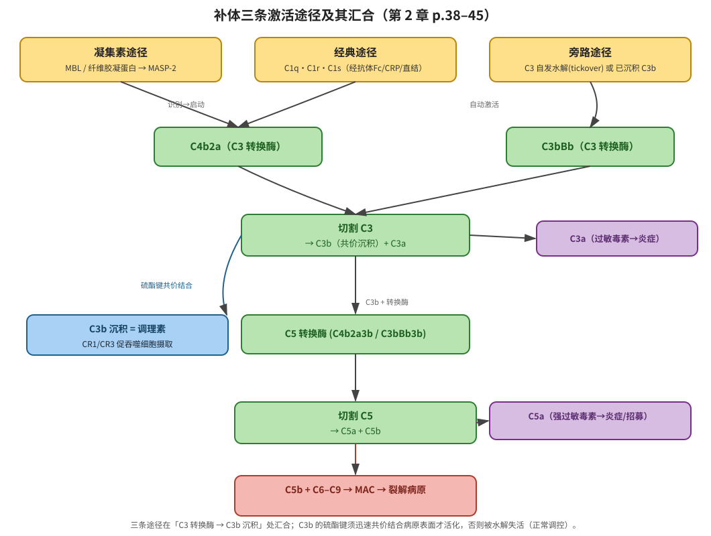
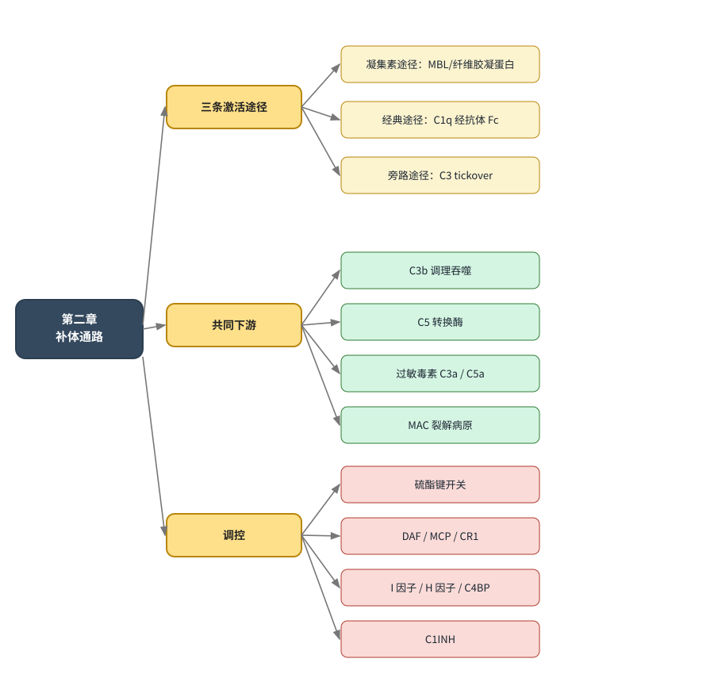

# 《詹韦免疫生物学（原书第九版）》第二章 · 补体起作用的通路 总结

> 来源：詹韦免疫生物学 原书第九版 Janeways Immunobiology (Kenneth Murphy, Casey Weaver) (z-library) · 中文译本 · 第二章「固有免疫：第一道防线」· 书中 p.38–54（补体相关小节 2-5 ~ 2-16）
> 说明：本总结聚焦「补体通过哪些通路被激活并发挥效应」，内容均取自第 2 章正文，并标注书中页码。

## 缩写词表（Abbreviations）

| 缩写 | 全称（原文） | 出处 |
|------|--------------|------|
| PRR | pattern recognition receptor（模式识别受体） | 2-6，p.39 |
| PAMP | pathogen-associated molecular pattern（病原体相关分子模式） | 2-6，p.39 |
| MBL | mannose-binding lectin（甘露糖结合凝集素） | 2-5，p.38 |
| MASP | MBL-associated serine protease（MBL 相关丝氨酸蛋白酶） | 2-5，p.38 |
| MAC | membrane attack complex（攻膜复合物） | 2-15，p.50 |
| TED | thioester-containing domain（含硫酯键结构域） | 2-6，p.40 |
| C1INH | C1 inhibitor（C1 抑制剂） | 2-16，p.53 |
| DAF | decay-accelerating factor（衰变加速因子） | 2-16，p.52 |
| MCP | membrane cofactor protein（膜辅蛋白） | 2-16，p.52 |
| CR1 | complement receptor 1（补体受体 1） | 2-13，p.49 |
| C4BP | C4b-binding protein（C4b 结合蛋白） | 2-16，p.53 |
| CRP | C-reactive protein（C 反应蛋白） | 2-7，p.43 |
| GlcNAc | N-acetylglucosamine（N-乙酰葡糖胺） | 2-6，p.41 |
| GalNAc | N-acetylgalactosamine（N-乙酰半乳糖胺） | 2-6，p.41 |
| TNF-α | tumor necrosis factor-α（肿瘤坏死因子-α） | 2-14，p.49 |
| HAE | hereditary angioedema（遗传性血管性水肿） | 2-16，p.53 |

> 注：补体固有命名中 **C2a** 是活性丝氨酸蛋白酶（与多数补体片段命名习惯相反，书中有专门提醒）；**C2b** 为小片段。

---

## 一、核心立意

补体是一组可溶性血浆蛋白，通过 **三条不同的识别/激活途径**（凝集素途径、经典途径、旁路途径）启动；三条途径在「产生 C3 转换酶 → 切割 C3 生成 C3b」这一中心步骤汇合，其后共用一套下游级联（C3b 调理、C5 转换酶、攻膜复合物 MAC、过敏毒素），从而实现对病原体的标记、炎症招募与裂解杀伤（2-5，p.38–39）。

---

## 二、三条激活途径（补体"起作用"的起点）

> 三条途径的根本区别在**最上游的识别与启动方式**；一旦产生 C3 转换酶，后续几乎完全相同。

### 1. 凝集素途径（Lectin pathway）— 2-6，p.39–41

- **识别分子**：血液中的可溶性 PRR——**MBL**（胶原凝集素 collectin）与三种**纤维胶凝蛋白（ficolin-1/2/3）**。它们识别微生物表面重复出现的糖类（甘露糖、岩藻糖、GlcNAc、乙酰化糖），而**不**结合脊椎动物细胞表面末端的唾液酸，因此具有病原特异性。
- **启动**：MBL / 纤维胶凝蛋白与 MASP-1、MASP-2（及 MASP-3）形成复合物（酶原状态）；结合病原体表面后 MASP-1 构象改变并激活 MASP-2。
- **级联**：活化 MASP-2 切割 **C4** → 释放 C4a，暴露 C4b 的硫酯键 → C4b 共价结合病原表面 → 结合 **C2** → MASP-2 切割 C2 生成 **C2a** → 形成 **C4b2a = C3 转换酶（凝集素途径）**。
- **意义**：MBL 或 MASP-2 缺陷者儿童期易反复发生常见胞外菌呼吸道感染，提示其在适应性免疫尚未成熟时的防御价值。

### 2. 经典途径（Classical pathway）— 2-7，p.42–43

- **识别分子**：**C1 复合物**（C1q + C1r + C1s）。C1q 为 6 个三聚体组成的六聚体，带 6 个球状头部。
- **启动方式（三种）**：
  1. C1q 球状头部**直接**结合某些细菌表面成分（如细菌蛋白、革兰氏阳性菌脂磷壁酸等多阴离子结构）；
  2. 通过 **C 反应蛋白（CRP）** 间接结合细菌表面磷胆碱；
  3. **最主要**：C1q 结合已锚定在病原体上的**抗体 Fc 段**——由此把补体效应与适应性免疫的识别联系起来（IgM 结合 C1q 效率最高，天然 IgM 可在感染后迅速激活补体）。
- **级联**：≥2 个球状头部结合配体 → C1r:C1s 构象改变 → C1r 自活化 → 切割 C1s → 活化 C1s 切割 **C4** 与 **C2** → **C4b2a = C3 转换酶**。
- **要点**：经典途径与凝集素途径**共用同一种 C3 转换酶 C4b2a**（常称"经典 C3 转换酶"），且 C1 整体结构与 MBL-MASP 复合物同源、功能相同。

### 3. 旁路途径（Alternative pathway）— 2-9，p.44–45

- **核心特点**：可**自动激活（tickover）**，是补体的"放大环路"，也是最早出现的途径。
- **启动方式一（由其他途径触发）**：凝集素/经典途径沉积在病原表面的 **C3b** 结合血浆 **B 因子** → 构象改变 → **D 因子**切割 B 因子 → 释放 Ba、生成 **Bb** → 形成 **C3bBb = 旁路途径 C3 转换酶**。
- **启动方式二（自发 tickover）**：血浆中 C3 持续、缓慢地**自动水解**为 C3(H₂O) → 结合 B 因子 → D 因子切割 → 形成短暂存在的液相 C3 转换酶 C3(H₂O)Bb → 切割 C3 产生 C3a 与 C3b；多数 C3b 被水解失活，**只有共价结合到微生物表面的 C3b** 才能继续介导 C3bBb 形成。
- **稳定化**：C3bBb 本身极不稳定，与**备解素（properdin，P 因子）**结合后稳定；备解素由中性粒细胞释放，可视为一类 PRR。
- **放大环路**：一旦任何途径产生 C3b → 形成 C3bBb → 切割更多 C3 → 更多 C3b → 更强放大（amplification loop），在补体激活中具有特殊地位。

### 三条途径对比速查

| 途径 | 识别/触发 | 启动蛋白酶 | C3 转换酶 | 与适应性免疫关系 |
|------|-----------|-----------|-----------|------------------|
| 凝集素途径 | MBL/纤维胶凝蛋白识别微生物糖类 | MASP-2 | C4b2a | 无直接关系（固有） |
| 经典途径 | C1q 直接结合病原 / CRP / 抗体 Fc | C1s | C4b2a | 经抗体 Fc，连接适应性免疫 |
| 旁路途径 | C3 自发水解（tickover）或已沉积 C3b | 因子 D | C3bBb | 无直接关系（固有，但放大前两者） |

---

## 三、三条途径的共同下游（补体如何"起作用"）

> 无论哪条途径，最终都汇合于 C3b 在病原表面的沉积，并依次引发以下效应（2-5、2-12、2-14、2-15，p.38–51）。

1. **C3 切割 → C3b + C3a**
   - **C3b**：通过高反应性**硫酯键（TED）**共价结合微生物表面，作为**调理素**促进吞噬细胞（表达 CR1/CR3/CR4 等）摄取（2-5，p.38）。
   - **C3a**：过敏毒素，结合肥大细胞/内皮细胞受体，诱发局部炎症。
2. **C5 转换酶形成**：C3b 与 C3 转换酶结合 → 形成 C5 转换酶（经典/凝集素途径为 **C4b2a3b**；旁路途径为 **C3bBb3b**，含两个 C3b 与一个 Bb）。
3. **C5 切割 → C5a + C5b**
   - **C5a**：最强过敏毒素，招募并激活中性粒细胞/单核细胞，增强调理吞噬、增加血管通透性与黏附分子表达（2-14，p.49）。
   - **C5b**：启动终末组装。
4. **攻膜复合物（MAC，C5b-9）**：C5b + C6 + C7 + C8 + C9 依次组装，C7/C8/C9 暴露疏水位点插入脂质双分子层，10–16 个 C9 多聚化形成 ~10 nm 亲水通道，破坏膜完整性、破坏 H⁺ 梯度、使蛋白酶进入，导致特定病原体裂解（2-15，p.50–51）。

> 书中指出：MAC 在宿主防御中的实际重要性有限，目前仅 C5–C9 缺陷与**奈瑟菌（Neisseria）**易感相关；相比之下，**C3b 调理吞噬**与**过敏毒素诱导的炎症**更具普遍防御价值。

---

## 四、关键调控：补体活性被"限制于病原表面"

- **硫酯键的成败是开关**：C3b / C4b 暴露硫酯键后，若**迅速共价结合邻近病原表面**则活化；否则被快速水解失活（这是正常情况下抑制旁路途径自发损伤的机制，2-5，p.38）。
- **宿主自我保护**：宿主细胞表面表达调控蛋白——**DAF、MCP、CR1**（膜结合）与血浆 **I 因子、H 因子、C4BP**——可降解沉积在自身细胞上的 C3b/C4b；微生物细胞壁缺乏这些辅助因子，反而提供 B 因子/C2 结合位点，使补体只在病原表面推进（2-16，p.52–54）。
- **经典途径专属调控**：**C1INH**（serpin）使活化 C1r:C1s 与 C1q 解离，限制 C4/C2 裂解；其缺陷导致遗传性血管性水肿（HAE）。

---

## 五、关系图（补体三条通路的启动与汇合，书中 p.38–45）

> 若上方图片未显示，可直接打开同目录下的 `补体通路关系图.svg`。图中颜色：黄=识别/激活，绿=级联放大，蓝=调理吞噬，紫=炎症，粉=攻膜。

## 六、本章补体部分思维导图

---

## 七、书中给出的典型临床/缺陷关联（便于记忆）

- **MBL 或 MASP-2 缺陷** → 儿童期反复胞外菌呼吸道感染（2-6，p.41）。
- **C3 或其结合分子缺陷** → 对肺炎链球菌等胞外菌易感性增加（2-13/2-14，p.49）。
- **备解素（P 因子）缺陷** → 奈瑟菌易感（2-9，p.45）。
- **C5–C9（MAC）缺陷** → 仅与奈瑟菌（淋病、脑膜炎球菌）易感相关（2-15，p.51）。
- **C1INH 缺陷** → 遗传性血管性水肿 HAE（2-16，p.53）。
- **I 因子缺陷** → 补体不受控激活、耗竭，反复化脓菌感染（2-16，p.53）。
